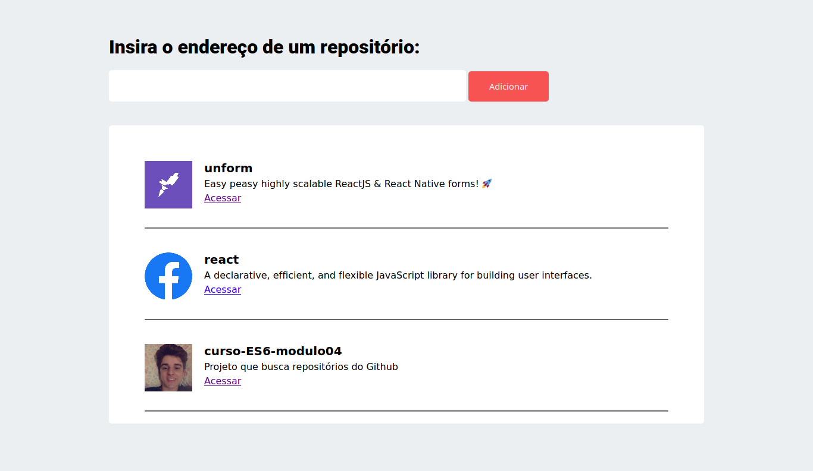

# Curso-ES6-modulo04
Projeto que busca repositórios do Github

## Resultado:

<p align="center">
  
</p>

## Requisitos:

<ul>
  <li>Node JS</li>
  <li>Yarn</li>
</ul>

## Início

### Instalando dependências
<ul>
  <li>No terminal execute o comando:
  
```
yarn
```
Obs: Certifique-se de executar esse comando no diretório da pasta com os arquivos.</li></ul>

### Configurando o webpack-dev-server

<ul>
  <li>Para subir o serviço do webpack, execute o seguinte comando no terminal:
  
```
yarn dev
```
  Em seguida, veja no terminal o endereço onde o servidor está rodando. Provavelmente estará rodando neste servidor: </li>
  
```
http://localhost:8080
```
</ul>


